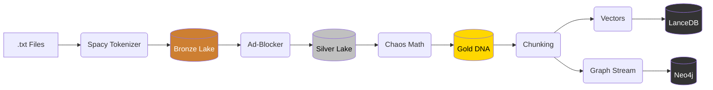

## 2. System Architecture

### 🏭 The "Factory" (ETL Pipeline)
Data flows through a strict **Medallion Architecture**, transforming from raw chaos to structured knowledge.

```mermaid
flowchart LR
    Raw[".txt Files"] --> Ingest(Spacy Tokenizer) --> Bronze[("Bronze Lake")]
    Bronze --> Cleaner(Ad-Blocker) --> Silver[("Silver Lake")]
    Silver --> Enrich(Chaos Math) --> Gold[("Gold DNA")]
    Gold --> Split(Chunking)
    Split --> Embed(Vectors) & Build(Graph Stream)
    Embed --> Lance[("LanceDB")]
    Build --> Neo[("Neo4j")]
    
    style Bronze fill:#cd7f32,color:white
    style Silver fill:#c0c0c0,color:black
    style Gold fill:#ffd700,color:black
    style Lance fill:#333,color:white
    style Neo fill:#333,color:white
```

