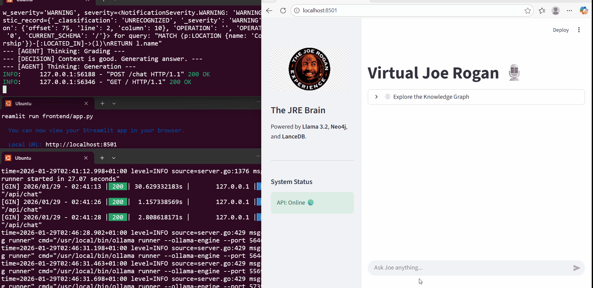
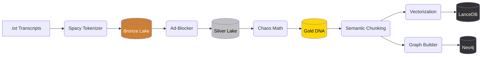
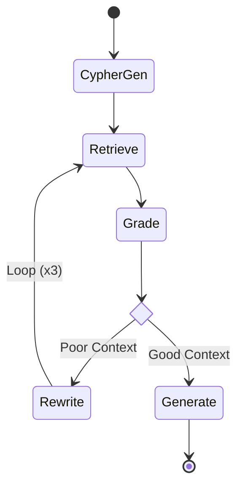

# 🧠 Chimpanzee: Autonomous GraphRAG Engine (v2.0)


> **"Ingesting 76 Million Tokens of Unstructured Audio to Clone a Human Mind."**



## 1. Executive Summary
**Project Chimpanzee** is a production-grade **Hybrid GraphRAG Platform** that ingests the entire catalog of the *Joe Rogan Experience* (2,228 episodes) and converts it into a queryable **Knowledge Graph**.

Unlike standard RAG systems that rely solely on vector similarity (often resulting in hallucinations), this system uses a **Self-Correcting State Machine**. The agent autonomously plans search strategies, grades document relevance, and rewrites its own queries if the initial retrieval is poor.

**Key Engineering Achievements:**
* **Scale:** Processed **76,639,229 Tokens** into a unified Knowledge Graph.
* **Memory Efficiency:** Implemented **Polars Streaming** to build a Neo4j graph with **26M+ edges** on consumer hardware ($O(1)$ RAM usage).
* **Performance:** Achieved **8.24s average latency** with a **7.1% Self-Correction Rate** on local hardware (RTX 4050).

---

## 2. System Architecture

### 🏭 The "Factory" (ETL Pipeline)
Data flows through a strict **Medallion Architecture**, transforming from raw chaos to structured knowledge.

### 🕸️ The Graph Ontology (Data Model)
Unlike a simple vector store, Chimpanzee maps the *relationships* between ideas.

* **Nodes:**
    * `(:PERSON)`: Extracted Guest Names (e.g., "Elon Musk", "Paul Stamets").
    * `(:CONCEPT)`: Key topics extracted via NLP (e.g., "Mycelium", "Mars Colonization").
* **Edges (Relationships):**
    * `(:PERSON)-[:DISCUSSED {weight: 5}]->(:CONCEPT)`: Links experts to topics they mentioned frequently.
    * `(:CONCEPT)-[:CO_OCCURRED {chaos: 8.5}]->(:CONCEPT)`: Links topics that appear together in heated debates.

**Why this matters:** This allows the agent to perform **Multi-Hop Reasoning**. It can answer *"Who are the experts on Mushrooms?"* by traversing `(Concept: Mushrooms) <-[:DISCUSSED]- (Person)`.
 
# 🧠 The "Brain" (Agent Workflow)

The inference engine is a **Cyclic State Machine** built with **LangGraph**.


## 3. How to Run (Reproduction Steps)

### Infrastructure Setup

1. Clone the Repo:
```bash
git clone https://github.com/YourUsername/project-chimpanzee.git
cd project-chimpanzee
pip install -r requirements.txt
```

2. Start Databases:
```bash
# Starts Neo4j Graph Database
docker-compose up -d neo4j

# Serve Llama 3.2 Model
ollama serve
```
Running the App
We use a Headless Backend + Streamlit Frontend architecture.

Terminal 1: Backend API
```bash
PYTHONPATH=. uvicorn src.api.main:app --reload --port 8001
```

Terminal 2: Frontend UI
```bash
PYTHONPATH=. streamlit run frontend/app.py
```

## 4. Pipeline Structure (Scripts)
### The scripts/ folder contains the sequential ETL logic.

| Sequence | Script                 | Description                                                              |
|----------|------------------------|--------------------------------------------------------------------------|
| 01       | `01_diagnose_raw.py`   | Health check raw text files (UTF-8, size).                               |
| 02       | `02_ingest_bronze.py`  | Ingest raw text → Bronze Parquet (Spacy Tokenization).                   |
| 03       | `03_clean_silver.py`   | Ad-Blocker: Removes sponsors using N-Gram analysis.                      |
| 04       | `04_enrich_gold.py`    | Feature Eng: Calculates "Chaos Score" (variance of sentence length).     |
| 05       | `05_chunk_data.py`     | Semantic chunking (1000 tokens w/ overlap).                              |
| 06       | `06_vectorize.py`      | Embedding generation (all-MiniLM-L6-v2).                                 |
| 07       | `07_build_graph.py`    | Graph Theory: Builds Guest ↔ Concept edges (streaming).                  |
| 08       | `08_load_neo4j.py`     | Batch loads 26M edges into Neo4j via Cypher UNWIND.                      |
| 09       | `09_load_vectors.py`   | Ingests vectors into LanceDB for hybrid search.                          |
| 10       | `10_verify_system.py`  | Connectivity check for all databases.                                    |

## 5. Evaluation & Benchmarks
### Benchmarked against a "Deep Fan" Golden Dataset (25 QA pairs) specifically designed to test Multi-Hop reasoning and Hallucination resistance.

| Metric            | Result         | Description                          |
|-------------------|----------------|--------------------------------------|
| Tokens Processed  | 76,639,229     | Full JRE Catalog                     |
| Avg Latency       | 8.24s          | Local Inference (RTX 4050)           |
| Self-Correction   | 7.1%           | Rate of query rewriting              |
| Vector Database   | LanceDB        | Disk-based (Low RAM)                 |

### Engineered by [Omar Jomaa](https://github.com/IAmOmarJomaa) ⚙️👨‍💻 Author